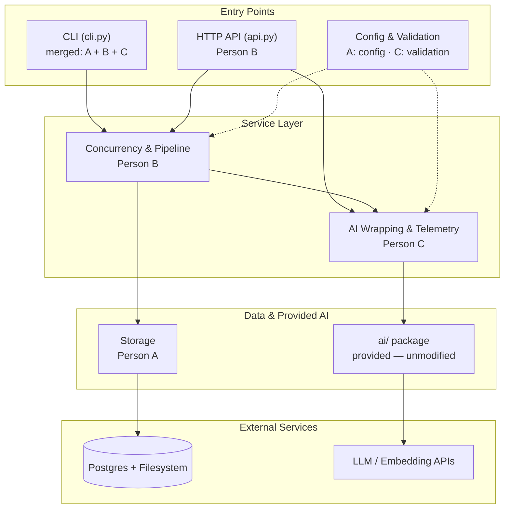

# Architecture — Smart Lost & Found

One diagram, colored by ownership. Rendered with Mermaid (GitHub renders this natively — no exported image needed).

## Module ownership

| Module | Owner | Responsibility |
|---|---|---|
| `src/api.py` | Person B (Ülkər Kərimova) | HTTP endpoints |
| `src/services/pipeline.py`, `services/concurrency/` | Person B | Orchestration, batching, rate limiting |
| `src/config.py` | Person A (Sadiq Sadiqov) | Typed settings from `.env` |
| `src/storage/` | Person A | Postgres + filesystem persistence |
| `src/services/ai_service.py`, `services/cache.py` | Person C (Oğuz Həsənli) | Retry, timeout, caching wrapper around `ai.*` |
| `src/telemetry/` | Person C | Cost tracking, OpenTelemetry tracing |
| `src/validation.py` | Person C | Input validation at API/CLI boundaries |
| `src/cli.py`, `src/models.py` | Merged (all three) | Shared domain model and command-line interface |
| `ai/` | Provided | Not modified by any team member |
